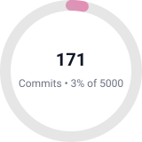
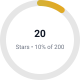
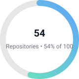

<h1 align="center">Hey there 👋 I'm <b>Ryan (raykaris)</b></h1>

💻 Web Developer • 🛡️ Cybersecurity Enthusiast • 🖥️ Software Engineer

  
  
  

---

## About me
- 👀 **Interests:** Web development · Software development · Cybersecurity  
- 🌱 **Currently Learning:** Defensive & Offensive Levels · Full-stack Development  
- 💞️ **Looking to Collaborate On:** Web projects · Software projects · Pentests  
- 📫 **Reach Me On:**  [LinkedIn](https://www.linkedin.com/in/ryan-muthoni-867b35431/)  
- ⚡ **Fun Fact:** Python isn’t named after the snake 🐍 — it’s named after *Monty Python* comedy!

---

## 🖥️ Portfolio

  

---

## 📊 GitHub Snapshot

  
  
  

  
  &nbsp;
  

---

<!-- Fun Animation -->
<h2 align="center">🚀 Let's Code Something Magical</h2>

  

---

<!-- Footer Badges -->

    
  

  Thanks for visiting — come back later and see how my progress grows! 🚀

